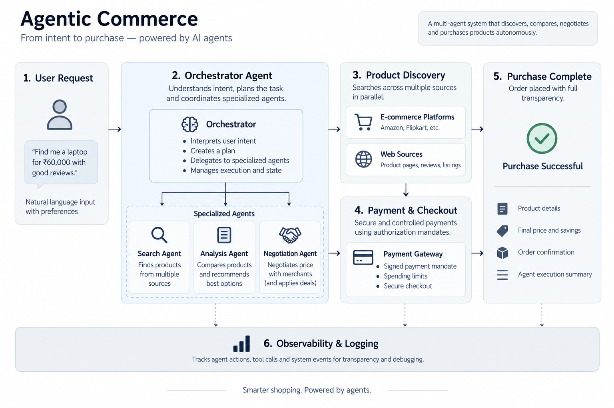

# Agentic Commerce

An autonomous e-commerce agent platform: natural-language product discovery over
Shopify's **Universal Commerce Protocol (UCP)**, A2A buyer/merchant negotiation,
AP2 payment mandates, and test-mode payment capture — behind one typed HTTP API
and the vanilla-JS storefront it serves (Gradio is legacy, retained but not served).

**Live Demo:** [https://agentic-commerce-233934596124.asia-south1.run.app/](https://agentic-commerce-233934596124.asia-south1.run.app/)



---

## Table of contents

- [1. What this is](#1-what-this-is)
- [2. Quickstart](#2-quickstart)
- [3. Playing with it](#3-playing-with-it)
- [4. The HTTP API](#4-the-http-api)
- [5. Configuration reference](#5-configuration-reference)
- [6. Developer guide: augmenting the system](#6-developer-guide-augmenting-the-system)
- [7. Tests, lint, and the definition of done](#7-tests-lint-and-the-definition-of-done)
- [8. Docker reference](#8-docker-reference)
- [9. Safety model (read this before touching payments)](#9-safety-model-read-this-before-touching-payments)
- [10. Troubleshooting](#10-troubleshooting)

---

## 1. What this is

A shopper types *"breathable running shirt under $60"*. Behind that sentence a
**concierge** fans work out to specialist agents that run in parallel —
`CatalogScout` (Shopify UCP Global Catalog), `WebScout` (open web),
`Negotiator` (A2A price haggling with a merchant agent), `Cashier`
(test-mode payment), `Analyst` (multi-criterion ranking that names a winner
*and its blind spots*). The turn streams back as typed events; every claim the
UI renders is backed by a structured payload, never by model prose.

Layering (see `FEATURES.md` for the full record):

```
Domain (UI-independent)      Agent runtime          Transports
a2a/  ap2/  core/  ucp/      backend/               api/  ui/  web/
payments/ ── thin shim ──→   backend/payments.py    (re-export only)
```

- **Domain packages** (`a2a/`, `ap2/`, `core/`, `ucp/`, `payments/`) own business
  logic and return structured data. They know nothing about any UI.
- **`backend/`** is the agent runtime (agent loop, crew, tools, session store).
  `backend/payments.py` and `backend/ap2.py` are **thin re-export shims** so
  import paths stay stable while logic lives in the domain packages.
- **`api/` + `ui/` + `web/`** are transports over the same domain. The real
  boundary is the **SSE contract** (`status`, `content`, `tool_call`,
  `tool_result`, `products`, `crew`, `artifact`, `done`, `error`) — that's what
  made a second frontend cheap instead of a rewrite.

Key protocol facts live in `project_memory.md` (UCP spec versions, auth tiers,
MCP tool glossary) and `project_context.md` (endpoints, key files).

---

## 2. Quickstart

### Prerequisites

- Python 3.11+ managed through **[uv](https://docs.astral.sh/uv/)** (`uv run`,
  `uv sync` — never raw `pip`/`python` for project work)
- Docker + Docker Compose (for the containerised stack)
- API keys: Google Gemini (`GEMINI_API_KEY` or `GOOGLE_API_KEY`) for the agent;
  Shopify `CLIENT_ID`/`CLIENT_SECRET` for catalog/auth; Razorpay test keys for
  payments. Everything is read from `.env` — **never baked into images**.

### Option A — Docker (recommended)

```bash
docker compose up -d --build
# API + web UI ... http://localhost:8010
# LEGACY (not served): Gradio chat was http://localhost:7860
# Telemetry included: Grafana http://localhost:3000 · Prometheus http://localhost:9090
docker compose logs -f api
```

This starts `api` (Razorpay payments reach Razorpay's hosted remote MCP server
directly, no extra container) and the telemetry stack
(`docker-compose.telemetry.yml`, folded in via `include:`) — one command,
everything up (LEGACY `ui`/Gradio service retained in compose but not served).

To skip telemetry for a lighter local run, name the services explicitly:

```bash
docker compose up -d --build api ui
```

### Option B — local processes

```bash
uv sync
uv run python -m agentic_commerce.api.server  # API + web UI on :8010 (active)
# LEGACY (not served): uv run python app.py  # Gradio chat was on :7860
```

`HOST`/`API_PORT` (API) are env-overridable; default `127.0.0.1` / `8010`
(legacy Gradio `HOST`/`PORT :7860` retired).

### Verify your setup

```bash
uv run ruff check src tests   # lint: clean
uv run pytest -q              # 265 passed, ~65s, across 26 test files
curl http://localhost:8010/openapi.json | head -c 200   # API alive
curl -o /dev/null -w "%{http_code}" http://localhost:8010/  # web UI alive → 200
```

---

## 3. Playing with it

Start here — each experiment exercises one subsystem and tells you where to
look next.

**1. Search something real.** In either frontend: *"breathable running shirt
under $60"*. Watch the crew events stream in (`CatalogScout` + `WebScout` race
via `asyncio.gather` in `backend/crew.py`). Then try a thin query the catalog
won't have (*"niche trail runners"*) and notice the UI tells you which source
came back empty instead of failing the turn.

**2. Ask for the best pick.** *"Which of these should I buy?"* routes to the
Analyst (`backend/analyst.py`). Open the score breakdown: missing signals are
*dropped and renormalized*, never scored as zero, and the winner's blind spots
travel in `ProductScore.missing`. Try: an unrated product — it carries *no
rating key at all*, never zero stars.

**3. Haggle.** The A2A negotiator (`a2a/`) bargains buyer-vs-merchant and
returns a structured `NegotiationResult` with rounds, transcript, and savings.

**4. Mint a mandate.** *"Generate an AP2 checkout payment mandate for my
active cart."* You get a signed HMAC-SHA256 ticket with a live expiry
countdown, one-click signature verification, copy-JSON, and a raw-payload
disclosure (`ap2/mandate.py`, `POST /api/mandate`, `POST /api/mandate/verify`).
Tamper with the JSON and re-verify — *expired* and *tampered* are distinguished,
never collapsed into "invalid".

**5. Capture test money.** `POST /api/payments/test`
`{"amount_cents": 100, "currency": "INR"}` routes Razorpay → Stripe → simulated
(`payments/gateway.py`). With `RAZORPAY_MCP_BRIDGE=1` the order is created
*through Razorpay's hosted remote MCP server* (`https://mcp.razorpay.com/mcp`,
streamable HTTP, HTTP Basic auth) instead of direct REST (`payments/mcp.py`).
Every receipt carries `live`, and the UI badge renders from that field — try a
simulated capture and confirm it says TEST / SIMULATED.

**6. Inspect your session as a graph.** `GET /api/session/{id}/graph` renders
the session as nodes/edges (~19× fewer tokens than the raw snapshot;
`backend/session_graph.py`). `GET /api/telemetry/{session_id}` shows spans and
token accounting per turn.

**7. Break the payment guard (safely).** Set `RAZORPAY_KEY_ID=rzp_live_...` and
call the test endpoint — it refuses and degrades to the simulated gateway.
That guard is the load-bearing safety test in `tests/test_payments.py`; an
autonomous agent must never move real money.

---

## 4. The HTTP API

24 paths, documented in `openapi.json` (OpenAPI 3.1.0, hand-kept in sync —
every `$ref` resolves, every path maps to a real callable). Groups:

| Group | Endpoints |
|---|---|
| Chat (SSE) | `POST /api/chat/stream`, `GET /api/examples`, `GET /api/models` |
| Discovery | `POST /api/search/products`, `POST /api/search/web`, `POST /api/discovery`, `GET /api/products/{id}`, `POST /api/analysis/best-pick` |
| Cart & checkout | `POST /api/cart`, `GET/PUT /api/cart/{id}` (PUT is full replacement), `POST /api/checkout` |
| Negotiation | `POST /api/negotiate` |
| Mandates | `POST /api/mandate`, `POST /api/mandate/verify` |
| Payments (test-mode) | `POST /api/payments/test` (mandate-free), `POST /api/payments/authorize` (mandate-gated), `GET /api/payments/{idempotency_key}`, `POST /api/payments/webhook/razorpay` |
| Session & introspection | `POST /api/session`, `GET /api/session/{id}`, `GET /api/session/{id}/results`, `GET /api/session/{id}/graph`, `GET /api/telemetry/{id}`, `GET /api/health` |

The streaming vocabulary (`status`, `content`, `tool_call`, `tool_result`,
`products`, `crew`, `artifact`, `done`, `error`) is emitted by
`CommerceAgent.execute_stream` and is the contract any new client builds
against — see `web/app.js` for the reference consumer.

---

## 5. Configuration reference

All via environment (`.env` locally, `env_file` in compose):

| Variable | Purpose | Default |
|---|---|---|
| `MODEL` | Gemini model id (`backend/model.py`, `ui/chat_engine.py`) | `gemini-2.5-flash` |
| `GEMINI_API_KEY` / `GOOGLE_API_KEY` | LLM auth | — (chat turns fail without it) |
| `CLIENT_ID` / `CLIENT_SECRET` | Shopify OAuth + webhook HMAC + AP2 signing | — (catalog works in lower tiers) |
| `CATALOG_ID` | Custom catalog whitelist; empty = Global Catalog | `''` |
| `RAZORPAY_KEY_ID` / `RAZORPAY_KEY_SECRET` | Razorpay (test keys `rzp_test_*` only) | — (simulated gateway) |
| `STRIPE_SECRET_KEY` / `STRIPE_API_KEY` | Stripe fallback (`sk_test_*` only) | — |
| `RAZORPAY_MCP_BRIDGE=1` | Route Razorpay orders through Razorpay's remote MCP server | off (direct REST) |
| `RAZORPAY_MCP_URL` | Remote MCP endpoint override | `https://mcp.razorpay.com/mcp` |
| `TAVILY_API_KEY` | Web search provider (else DuckDuckGo) | — |
| `RAZORPAY_WEBHOOK_SECRET` | Verifies `X-Razorpay-Signature` on `/api/payments/webhook/razorpay`; unset = the route refuses with `503` | — |
| `AC_PAYMENTS_PERSIST` / `AC_PAYMENTS_DB` | Payment ledger (idempotency, mandate single-use, webhook dedupe) on/off + path | on / `.agentic_commerce/payments.db` (compose: `/data/payments.db`) |
| `AC_PAYMENTS_STRICT` | Refuse the built-in placeholder AP2 signing key when no `CLIENT_SECRET` is set | off |
| `AC_SESSION_PERSIST` / `AC_SESSION_DB` | SQLite session snapshots on/off + path | on / `.agentic_commerce/sessions.db` (compose: `/data/sessions.db` shared volume) |
| `HOST` / `API_PORT` | Bind host + API port (single FastAPI port) | `127.0.0.1` / `8010` (legacy Gradio `PORT 7860` retired) |
| `OTEL_EXPORTER_OTLP_ENDPOINT` / `OTEL_SDK_DISABLED` | Telemetry export | `http://localhost:4318` / enabled |

---

## 6. Developer guide: augmenting the system

### Add an agent tool (the most common extension)

1. Write the domain function returning **structured data** (dict/dataclass with
   `as_dict()`), e.g. in `backend/` or a domain package — never Markdown.
2. Wrap it as a LangChain `@tool` in `backend/tools.py` that formats Markdown
   *for the model only* and records progress via `trace_tool_execution`.
3. Add behaviour-named tests (`test_<invariant>_...`, not `test_<function>_...`).
4. If it needs HTTP exposure, add a thin route in `api/server.py` calling the
   domain function directly (skip the Markdown), and mirror it in
   `openapi.json`.

### Add a payment capability

`payments/` is the home: `settings.py` (env, the single guard site, `live` derivation),
`models.py` (states, error taxonomy, `PaymentResult`), `ledger.py` (idempotency,
mandate claims, webhook dedupe), `providers/` (`razorpay.py`, `stripe.py`,
`simulated.py`, `mcp.py` behind one protocol), `gateway.py` (provider resolution and
reconciliation), `flow.py` (the mandate-gated state machine). `config.py`, `razorpay.py`
and `mcp.py` at the package root are compatibility shims. Rules:

- Raw `httpx` — **no payment SDK becomes a dependency** (project decision).
- Every receipt states `live`; test keys only (`rzp_test_*`, `sk_test_*`).
- `backend/payments.py` stays a re-export shim — update it when you add a
  public name so `crew`/`tools`/`server` imports keep working.
- Razorpay has no idempotency header, so the **ledger** (`payments/ledger.py`) is the
  dedupe: an attempt row is written before the provider call and a repeated key returns
  the stored result without contacting anyone.
- A provider is only swapped out for a failure that happened *before* transmission. A
  request that went out and was not answered becomes `PaymentState.UNKNOWN` and is
  resolved by `find_by_receipt`, never by a retry elsewhere — that is how one shopper
  action stops being able to create two orders.
- Charges go through `payments/flow.py`, not straight to `process_payment`: a signed,
  unexpired, in-scope, unspent AP2 mandate authorizes exactly one payment.

### Extend the MCP bridge

`payments/providers/mcp.py` is a real MCP client (`mcp.ClientSession` over
`streamablehttp_client`, talking to Razorpay's hosted remote MCP server at
`https://mcp.razorpay.com/mcp`, HTTP Basic auth over the same key id/secret the
REST API uses): it completes the `initialize` handshake before calling
anything, asserts the tools it needs appear in `tools/list`, resolves each
tool's id argument from that tool's own `inputSchema`, and enforces a
per-request timeout. This is Razorpay's own recommended deployment path — no
local container, no Docker socket — and when `RAZORPAY_MCP_BRIDGE=1` a bridge
failure is raised rather than degraded to REST, because both paths create orders.

To expose more tools (payment links, settlements — `create_refund`,
`close_qr_code`, and `create_instant_settlement` are local-server-only per
Razorpay's tools reference and unavailable remotely), add a method that calls
`call_tool` and maps the JSON onto `PaymentResult`, and cover it with a hermetic
test (fake `streamablehttp_client`/`ClientSession`, see
`tests/test_payments_mcp.py`). Live-server checks stay manual and read-only
where possible (`fetch_*` before any write).

### Build a third frontend

Consume `POST /api/chat/stream` SSE events and the REST paths above; respect
the honesty invariants or the UI is buggy by definition: `PaymentResult.live`
always rendered; missing ratings absent, never zero; `ProductScore.missing`
surfaced; web results get **no** cart button (absence, not a disabled button);
review counts labelled popularity, never sales.

### Work with the docs

- `project_memory.md` — protocol truth (versions, tiers, tool specs). Update it
  when UCP/MCP behaviour changes.
- `project_context.md` — static facts (stack, endpoints, key files).
- `FEATURES.md` — what *runs today*, including a plain **Not built yet** list
  (no capture, no mandate-gated charges, no webhooks/refunds/orders store).
  Keep it honest: don't list it until it runs.

---

## 7. Tests, lint, and the definition of done

```bash
uv run ruff check src tests          # E,F,I,UP,B,SIM · line-length 100
uv run pytest -q                     # 265 passed · 26 files · ~65s
uv run pytest tests/test_payments.py tests/test_payments_mcp.py -q
```

The four-step loop is mandatory before anything is called done: trace the root
cause → minimal anchored edit → `ruff` + `pytest` → clean exit code required.
No symptom patching: never swallow exceptions, invent fallbacks, or
delete/comment-out failing tests. A test that documents an outdated contract
may change only as an explicitly declared contract change. Browser JS
(`web/app.js`) is covered from pytest via a Node `vm` harness
(`tests/js/markdown_harness.mjs`) — no JS runner needed.

---

## 8. Docker reference

```bash
docker compose up -d --build        # api :8010 · telemetry :3000/:9090; ui :7860 is LEGACY
docker compose up -d --build api ui   # opt out of telemetry
docker compose ps                   # api + telemetry stack healthy
docker compose logs -f api
docker compose down                 # stack down; session-data volume persists
```

- Image: `python:3.13-slim` + `uv sync --locked --no-dev`; non-root `appuser`
  everywhere — Razorpay payments reach MCP over Razorpay's hosted remote
  server, so no Docker CLI/socket and no root override are needed in this
  image or compose file.
- UCP demo scripts (`backend/*_demo.js`, `ucp_demo.js`) run via Node and are
  intentionally *not* in the image: `node --env-file=.env
  src/agentic_commerce/backend/ucp_demo.js`.

---

## 9. Safety model (read this before touching payments)

1. **Test keys only.** `rzp_test_*` / `sk_test_*`; anything else raises
   `PaymentConfigurationError`. The guard lives in exactly one place
   (`payments/settings.py`), and `PaymentResult.live` is *derived* from the credential
   mode rather than written as a literal by each provider. Stripe PaymentIntents are
   created, never confirmed; Razorpay Orders are created, never paid; capture is
   implemented, tested, and switched off (`CaptureNotEnabledError`). **Nothing in this
   repo moves money, including in test mode.**
2. **A mandate authorizes the charge.** `payments/flow.py` verifies the AP2 signature
   (now over the whole payload, so `merchant_domain`, `buyer_id` and
   `spending_limit_cents` can no longer be edited in flight), checks expiry, limit,
   currency, cart and merchant, then claims the mandate in the ledger so it can
   authorize exactly one payment. The refusals are distinct: expired, tampered,
   out-of-scope and already-spent are different answers.
3. **Honesty is structural.** Missing data is absent (no rating key, no cart
   button, `live` always present) so no model paraphrase can turn a caveat
   into a claim. An unconfirmed payment reports `state: "unknown"` rather than
   guessing in either direction.
4. **Independent failure.** Either scout can fail and the turn degrades with the gap
   named. Payment fallback is narrower on purpose: only a pre-transmission failure
   licenses another provider.
5. **Sessions are bearer capabilities** (`ac_session` cookie + header +
   `localStorage`) over plain HTTP — fine for local dev, not a production
   auth story (see `FEATURES.md` §7).

---

## 10. Troubleshooting

| Symptom | Likely cause → fix |
|---|---|
| `401`/`-32000 AuthenticationFailed` on merchant checkout | Store restricts programmatic checkout → Cart MCP `continue_url` referral handoff is the universal path (`project_memory.md` §4.2) |
| Catalog searches return nothing | Custom `CATALOG_ID` whitelist is empty/restrictive → unset it for Global Catalog |
| Payments always `simulated` | No test keys in env, or bridge off with no keys → set `rzp_test_*` keys / `RAZORPAY_MCP_BRIDGE=1` |
| MCP bridge reports "unreachable or unauthorized" | Bad/expired Razorpay key id or secret, or no network egress to `mcp.razorpay.com` → verify `RAZORPAY_KEY_ID`/`RAZORPAY_KEY_SECRET`, override `RAZORPAY_MCP_URL` only for a staging endpoint |
| UI shows previous turn's agents on chit-chat | Regression of the `execute_stream`/`_stream_turn` identity fix — see `FEATURES.md` §5 |
| Clicks do nothing (dark tint over page) | `[hidden]` display regression — `web/styles.css` guard + `tests/test_web_assets.py` |
| `uv sync` fails in Docker build | Stale lockfile → `uv lock` locally, rebuild; never hand-edit `uv.lock` |
